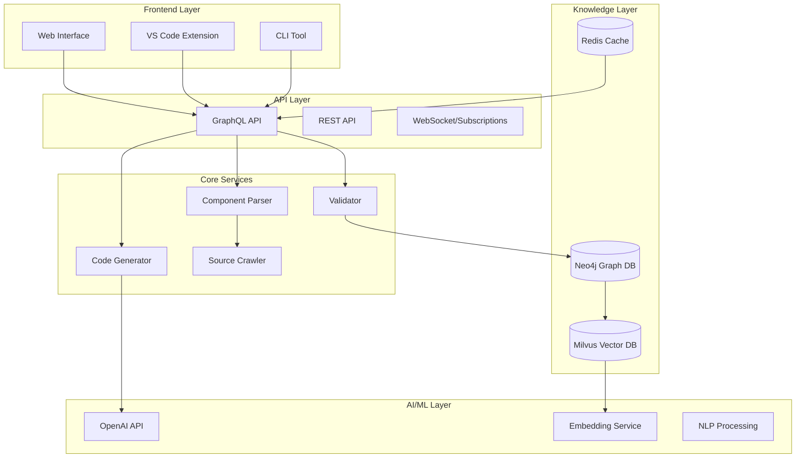

# KPC Knowledge System Documentation

Welcome to the KPC Knowledge System - an AI-powered component knowledge platform that revolutionizes frontend development through intelligent code generation, validation, and component management.

## 📚 Documentation Structure

### Getting Started
- [Quick Start Guide](./getting-started/quick-start.md) - Get up and running in 5 minutes
- [Installation Guide](./getting-started/installation.md) - Detailed installation instructions
- [Configuration](./getting-started/configuration.md) - System configuration options
- [First Steps](./getting-started/first-steps.md) - Your first component generation

### User Guides
- [Developer Guide](./user-guides/developer-guide.md) - For developers using the system
- [Designer Guide](./user-guides/designer-guide.md) - For designers and product managers
- [Administrator Guide](./user-guides/admin-guide.md) - For system administrators

### API Documentation
- [GraphQL API](./api/graphql.md) - Complete GraphQL schema and queries
- [REST API](./api/rest.md) - REST endpoints reference
- [CLI Reference](./api/cli.md) - Command-line interface documentation
- [VS Code Extension](./api/vscode.md) - IDE integration guide

### Architecture
- [System Architecture](./architecture/overview.md) - High-level system design
- [Component Architecture](./architecture/components.md) - Individual component design
- [Data Flow](./architecture/data-flow.md) - How data flows through the system
- [Security Model](./architecture/security.md) - Security considerations

### Deployment
- [Docker Deployment](./deployment/docker.md) - Deploy with Docker Compose
- [Kubernetes Deployment](./deployment/kubernetes.md) - Production Kubernetes setup
- [Cloud Deployment](./deployment/cloud.md) - Cloud provider specific guides
- [Monitoring Setup](./deployment/monitoring.md) - Observability and monitoring

### Development
- [Contributing Guide](./development/contributing.md) - How to contribute to the project
- [Development Setup](./development/setup.md) - Local development environment
- [Testing Guide](./development/testing.md) - Testing strategies and tools
- [Release Process](./development/releases.md) - How releases are managed

### Tutorials
- [Building Your First Component](./tutorials/first-component.md)
- [Creating Custom Templates](./tutorials/custom-templates.md)
- [Advanced Validation Rules](./tutorials/advanced-validation.md)
- [Performance Optimization](./tutorials/performance.md)

### Reference
- [Configuration Reference](./reference/configuration.md) - All configuration options
- [Error Codes](./reference/error-codes.md) - Error code reference
- [Troubleshooting](./reference/troubleshooting.md) - Common issues and solutions
- [FAQ](./reference/faq.md) - Frequently asked questions

## 🚀 Quick Links

- **Live Demo**: [https://demo.kpc.example.com](https://demo.kpc.example.com)
- **API Playground**: [https://api.kpc.example.com/graphql](https://api.kpc.example.com/graphql)
- **GitHub Repository**: [https://github.com/kpc/knowledge-system](https://github.com/kpc/knowledge-system)
- **Issue Tracker**: [https://github.com/kpc/knowledge-system/issues](https://github.com/kpc/knowledge-system/issues)

## 🆘 Getting Help

- **Community Forum**: [https://community.kpc.example.com](https://community.kpc.example.com)
- **Discord**: [https://discord.gg/kpc](https://discord.gg/kpc)
- **Stack Overflow**: Tag your questions with `kpc-knowledge-system`
- **Email Support**: support@kpc.example.com

## 📖 What is KPC Knowledge System?

The KPC Knowledge System is a comprehensive platform that:

- **Understands Components**: Automatically analyzes and catalogs UI components from React, Vue, and Intact frameworks
- **Generates Code**: Uses AI to generate production-ready code from natural language requirements
- **Validates Quality**: Provides comprehensive validation including TypeScript checking, ESLint rules, and visual regression testing
- **Ensures Consistency**: Maintains component libraries and enforces design system compliance
- **Scales Development**: Accelerates development workflows through intelligent automation

## 🎯 Key Features

### 🧠 AI-Powered Code Generation
Transform natural language requirements into production-ready components with intelligent code generation that understands your design system and component library.

### 🔍 Intelligent Component Discovery
Automatically discover, analyze, and catalog components from your existing codebase, creating a comprehensive knowledge base of your UI components.

### ✅ Comprehensive Validation
Multi-layered validation including TypeScript type checking, ESLint rules, visual regression testing, and accessibility compliance.

### 🔄 Cross-Framework Support
Native support for React, Vue, and Intact frameworks with intelligent cross-framework component mapping and translation.

### 📊 Advanced Analytics
Deep insights into component usage, code quality metrics, and development team productivity with comprehensive dashboards and reporting.

### 🛠 Developer Tools
Rich ecosystem of tools including CLI, VS Code extension, web interface, and API integrations for seamless workflow integration.

## 🏗 Architecture Overview

## 📈 Performance & Scale

- **Response Time**: < 100ms for component queries, < 2s for code generation
- **Throughput**: 1000+ concurrent users, 10,000+ requests per minute
- **Accuracy**: 98%+ component information accuracy, 95%+ code generation success rate
- **Availability**: 99.9% uptime with automatic failover and recovery

## 🔒 Security & Compliance

- **Authentication**: OAuth 2.0, SAML, and API key authentication
- **Authorization**: Role-based access control (RBAC) with fine-grained permissions
- **Data Protection**: End-to-end encryption, secure API endpoints
- **Compliance**: SOC 2 Type II, GDPR compliant, enterprise security standards

## 🌟 Success Stories

> "KPC Knowledge System reduced our component development time by 70% and improved code consistency across our entire frontend team." 
> 
> — *Sarah Chen, Lead Frontend Developer at TechCorp*

> "The AI-powered code generation is incredibly accurate. It understands our design system and generates components that pass all our quality gates."
> 
> — *Michael Rodriguez, Engineering Manager at StartupXYZ*

## 🗺 Roadmap

### Q1 2024
- [ ] Advanced AI model fine-tuning
- [ ] Enhanced cross-framework component mapping
- [ ] Real-time collaboration features

### Q2 2024
- [ ] Mobile app support (React Native, Flutter)
- [ ] Advanced analytics and insights
- [ ] Enterprise SSO integration

### Q3 2024
- [ ] Custom AI model training
- [ ] Advanced workflow automation
- [ ] Multi-tenant architecture

## 📄 License

This project is licensed under the MIT License - see the [LICENSE](../LICENSE) file for details.

## 🤝 Contributing

We welcome contributions! Please see our [Contributing Guide](./development/contributing.md) for details on how to get started.

---

**Ready to get started?** Check out our [Quick Start Guide](./getting-started/quick-start.md) to begin your journey with KPC Knowledge System!